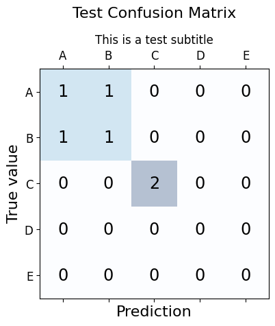

# ml_eval_kit
A python package for evaluation of trained machine learning models.


# Example usage

## Plots
The functions `get_conf_matrix` and `create_conf_matrix_fig` can be used to create a confusion matrix figure, given some true labels and predictions.
```
from ml_eval.plots import get_conf_matrix, create_conf_matrix_fig

m = get_conf_matrix([0, 1, 2, 0, 1, 2],
                    [0, 1, 2, 1, 0, 2])

create_conf_matrix_fig(m, classes=["A", "B", "C", "D", "E"],
                       title="Test Confusion Matrix",
                       subtitle="This is a test subtitle")
```



## CLI Tool usage
Start the `ml-eval` tool by running

```
ml-eval --y_true tests/y_true.csv --y_pred tests/y_pred.csv --output results/
```